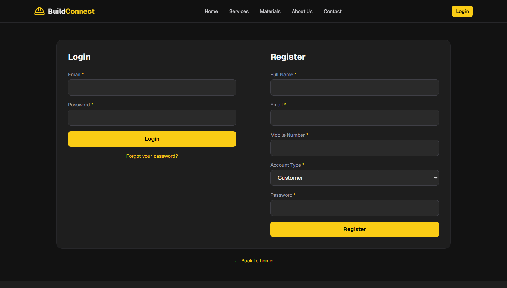
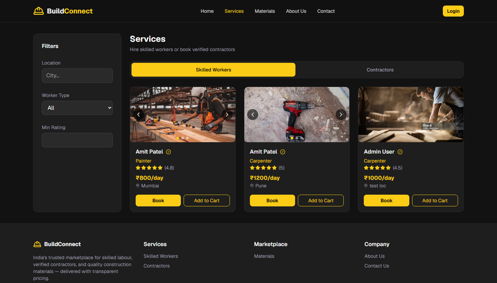
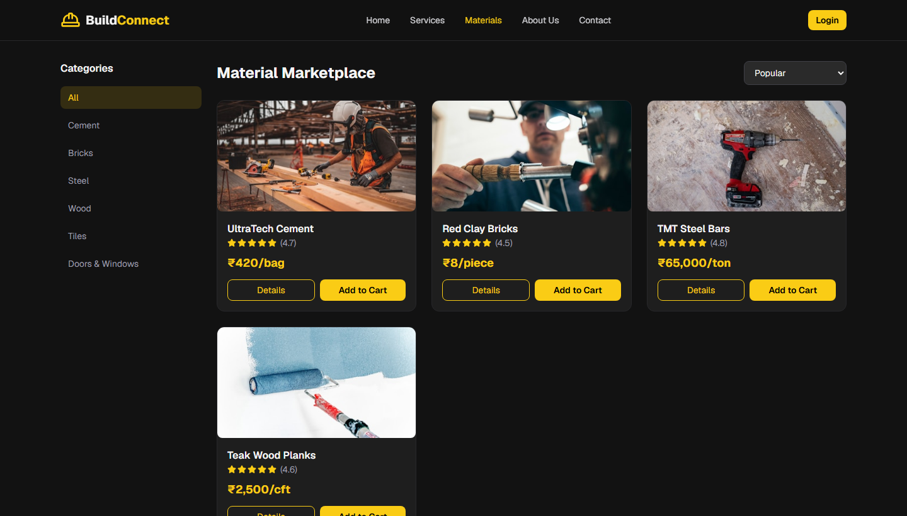
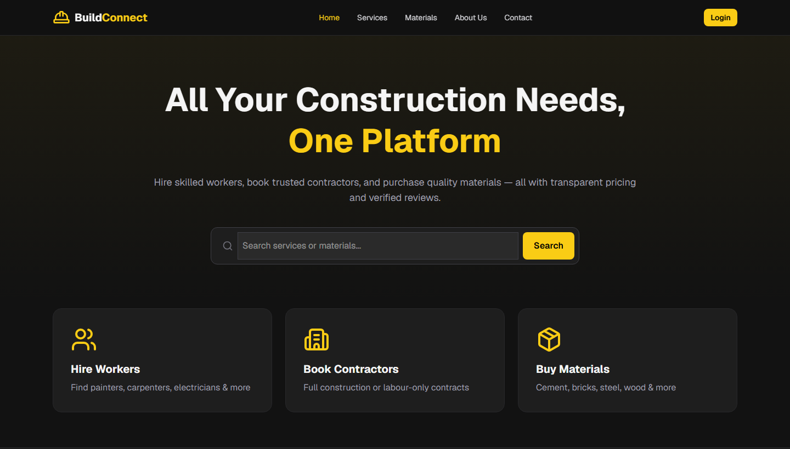
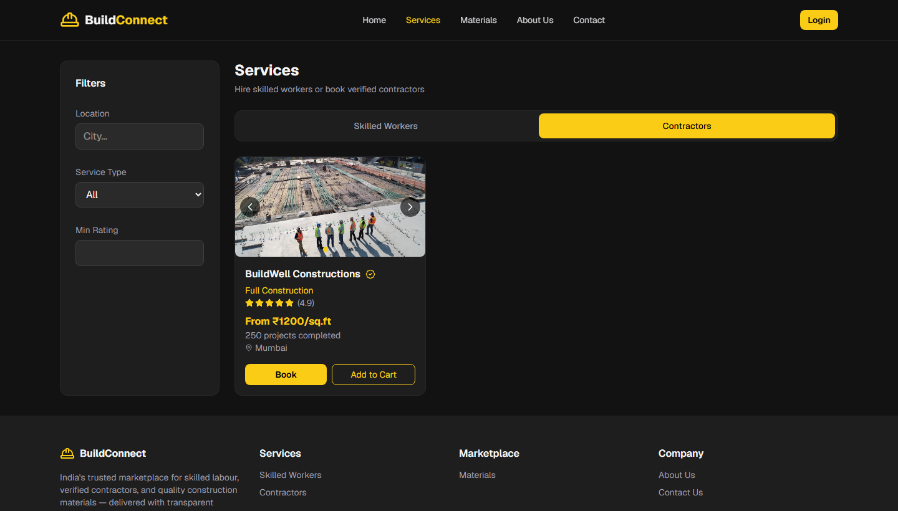

# CONSTRUCTION SERVICE & MATERIAL MANAGEMENT SYSTEM

---

## PROJECT REPORT SUBMITTED TO BHARATHIAR UNIVERSITY IN PARTIAL FULFILLMENT OF THE REQUIREMENT FOR THE AWARD OF THE DEGREE OF MASTER OF COMPUTER APPLICATIONS

---

**HARIPRASAD T B**

**Enrolment No.: 232MCAN0168**

**Reg. No.: 23MCA5168**

---

**Under the guidance of**

**DR. S. MEERA**

**Associate Professor & Head (I/c)**

**Department of Computer Science (AI)**

---

**Centre for Distance and Online Education**

**Bharathiar University**

**Coimbatore 641 046**

**June 2026**

---

\newpage

## E-WRAPPER (FRONT COVER)

**CONSTRUCTION SERVICE & MATERIAL MANAGEMENT SYSTEM**

Project Report submitted to Bharathiar University in partial fulfillment of the requirement for the award of the Degree of Master of Computer Applications

**HARIPRASAD T B**

**Enrolment No.: 232MCAN0168**

**Reg. No.: 23MCA5168**

Under the guidance of

**DR. S. MEERA**

Associate Professor & Head (I/c)

Centre for Distance and Online Education

Bharathiar University

Coimbatore 641 046

**June 2026**

---

\newpage

## COPY OF THE WRAPPER (BACK COVER)

**CONSTRUCTION SERVICE & MATERIAL MANAGEMENT SYSTEM**

Project Report submitted to Bharathiar University in partial fulfillment of the requirement for the award of the Degree of Master of Computer Applications

**HARIPRASAD T B**

**Enrolment No.: 232MCAN0168**

**Reg. No.: 23MCA5168**

Under the guidance of

**DR. S. MEERA**

Associate Professor & Head (I/c)

Centre for Distance and Online Education

Bharathiar University

Coimbatore 641 046

**June 2026**

---

\newpage

## DECLARATION

I hereby declare that this project work titled **"CONSTRUCTION SERVICE & MATERIAL MANAGEMENT SYSTEM"** submitted to the Centre for Distance and Online Education, Bharathiar University is a record of original work done by **HARIPRASAD T B** under the supervision and guidance of **Dr. S. Meera**, Associate Professor & Head (I/c), Department of Computer Science (AI), and that this project work has not formed the basis for the award of any Degree/Diploma/Associateship/Fellowship or similar title to any candidate of any University.

<br><br>

**Signature of the Candidate**

**Name:** HARIPRASAD T B

**Enrolment No.:** 232MCAN0168

**Register No.:** 23MCA5168

**Course:** Master of Computer Applications (MCA)

**Place:** _______________

**Date:** _______________

<br><br>

**Countersigned by**

**Signature of the Guide** | **Countersigned by the Co-ordinator**

(With Seal) | (With Seal)

---

\newpage

## CERTIFICATE

This is to certify that the Major Project work titled **"CONSTRUCTION SERVICE & MATERIAL MANAGEMENT SYSTEM"** submitted to Bharathiar University in partial fulfillment of the requirements for the award of the Degree of Master of Computer Applications is a record of the original work done by **HARIPRASAD T B** under my supervision and guidance and that this project work has not formed the basis for the award of any Degree/Diploma/Associateship/Fellowship or similar title to any candidate of any University.

<br><br>

**Signature of the Guide**

(With Seal)

**Dr. S. Meera**

Associate Professor & Head (I/c)

Department of Computer Science (AI)

<br><br>

**Programme Co-ordinator**

(With Seal)

<br><br>

**Forwarded by**

**Director**

Centre for Distance and Online Education

Bharathiar University

Coimbatore - 46

---

\newpage

## CERTIFICATE FROM THE ORGANIZATION

*(To be obtained if project work was undertaken at an industry organization. If the project was carried out as an individual academic project, a certificate from the Head of the Department may be enclosed in place of this certificate.)*

This is to certify that **Mr./Ms. HARIPRASAD T B**, Enrolment No. **232MCAN0168**, Reg. No. **23MCA5168**, student of Master of Computer Applications, Centre for Distance and Online Education, Bharathiar University, has successfully completed the Major Project titled **"CONSTRUCTION SERVICE & MATERIAL MANAGEMENT SYSTEM"** during the period from _______________ to _______________ at this organization.

<br><br>

**Name of the Organization:** _______________________________________________

**Address:** _______________________________________________

<br><br>

**Signature of the Head of the Organization**

(With Seal)

**Date:** _______________

---

\newpage

## ACKNOWLEDGEMENT

The candidate expresses sincere gratitude to **Dr. S. Meera**, Associate Professor & Head (I/c), Department of Computer Science (AI), for her valuable guidance, continuous support, and encouragement throughout the completion of this Major Project work.

The candidate is thankful to the Director and Programme Co-ordinator, Centre for Distance and Online Education, Bharathiar University, for providing the opportunity to undertake this project as part of the Master of Computer Applications programme during the academic years 2023–2025.

The candidate also extends thanks to the faculty members of the Department of Computer Science (AI) for their academic support, and to family and friends for their motivation during the course of this work.

<br><br>

**HARIPRASAD T B**

---

\newpage

## SYNOPSIS

The construction industry in India has traditionally depended upon informal networks, local referrals, and physical visits to suppliers for hiring skilled labour, booking contractors, and procuring building materials.  This conventional approach has resulted in lack of transparency in pricing, difficulty in verifying service quality, fragmented communication between stakeholders, and absence of a unified digital record for bookings and purchases.  The need for a comprehensive web-based solution that integrates multiple construction-related services on a single platform has therefore been identified as a significant requirement in the present digital era.

The **Construction Service & Material Management System** has been developed as a full-stack construction marketplace web application to address the above challenges.  The system has been designed to connect customers with skilled workers, verified contractors, and material vendors through a unified online platform.  The application supports five distinct user roles, namely Customer, Worker, Contractor, Vendor, and Administrator, each of which has been provided with role-specific dashboards and permissions.  Customers have been enabled to browse and hire workers, book contractors, purchase construction materials, manage a shopping cart, track orders and bookings, and submit reviews.  Service providers and vendors have been given dedicated panels to manage their listings, bookings, orders, and earnings.  Administrators have been provided with comprehensive tools to oversee users, providers, vendors, materials, bookings, and orders across the entire platform.

The frontend of the application has been implemented using **Next.js 16** and **React 19** with **Tailwind CSS 4** for responsive user interface design.  The backend has been built using **Next.js API Routes** following RESTful architecture principles.  **MongoDB** has been used as the database management system with **Mongoose** as the object data modelling layer.  Authentication and session management have been implemented using **JSON Web Tokens (JWT)** stored in secure HTTP-only cookies, and passwords have been hashed using **bcrypt**.  Additional features such as per-user shopping cart using **Zustand**, image-based listings, filters, ratings, reviews, and dashboard analytics using **Recharts** have also been incorporated into the system.

The project has been analysed through problem identification, feasibility study, system design using Data Flow Diagrams and Entity Relationship Diagrams, modular implementation, and comprehensive testing at unit, integration, and user acceptance levels.  The system has been found to fulfil the stated objectives and has demonstrated how a unified digital marketplace can improve accessibility, transparency, and operational efficiency in the construction services sector.  Future enhancements such as payment gateway integration, notification services, mobile application development, and cloud deployment have been identified for subsequent development phases.

**Keywords:** Construction Marketplace, Next.js, MongoDB, JWT Authentication, Role-Based Access Control, E-Commerce, Service Booking, MCA Major Project

---

\newpage

## TABLE OF CONTENTS

| | | Page No. |
|---|---|---|
| | E-Wrapper | |
| | Copy of the Wrapper | |
| | Declaration | |
| | Certificate | |
| | Certificate from the Organization | |
| | Acknowledgement | (i) |
| | Synopsis | (ii) |
| **1** | **INTRODUCTION** | **1** |
| 1.1 | System Overview | 2 |
| 1.2 | Organization Profile | 3 |
| **2** | **SYSTEM STUDY AND ANALYSIS** | **4** |
| 2.1 | Problem Statement | 5 |
| 2.2 | Existing System | 6 |
| 2.2.1 | Drawbacks | 7 |
| 2.3 | Proposed System | 8 |
| 2.3.1 | Advantage | 9 |
| 2.4 | Feasibility Analysis | 10 |
| 2.4.1 | Technical Feasibility | 11 |
| 2.4.2 | Economic Feasibility | 12 |
| 2.4.3 | Operational Feasibility | 13 |
| 2.4.4 | Cost Estimation and Scheduling | 14 |
| **3** | **DEVELOPMENT ENVIRONMENT** | **15** |
| 3.1 | Hardware Requirement | 16 |
| 3.2 | Software Requirement | 17 |
| 3.3 | Programming Environment | 18 |
| 3.3.1 | About Next.js | 19 |
| 3.3.2 | About MongoDB | 20 |
| **4** | **SYSTEM DESIGN AND DEVELOPMENT** | **21** |
| 4.1 | Element of Design | 22 |
| 4.1.1 | Process Design | 23 |
| 4.1.2 | Concept Design | 24 |
| 4.1.3 | Logical Design | 25 |
| 4.1.4 | Physical Design | 26 |
| 4.1.5 | Input Design | 27 |
| 4.1.6 | Output Design | 28 |
| 4.1.7 | Database Design | 29 |
| 4.2 | Table Structure | 30 |
| **5** | **SYSTEM TESTING AND IMPLEMENTATION** | **31** |
| 5.1 | System Testing | 32 |
| 5.1.1 | Unit Testing | 33 |
| 5.1.2 | Integration Testing | 34 |
| 5.1.3 | User Acceptance Testing | 35 |
| 5.1.4 | Output Testing | 36 |
| 5.1.5 | Validation Testing | 37 |
| 5.2 | System Security | 38 |
| 5.3 | System Enhancement | 39 |
| **6** | **CONCLUSION AND FURTHER ENHANCEMENT** | **40** |
| 6.1 | Conclusion | 41 |
| 6.2 | Further Enhancement | 42 |
| **7** | **BIBLIOGRAPHY & REFERENCES** | **43** |

---

\newpage

# CHAPTER 1

# INTRODUCTION

## 1.1 System Overview

The construction sector has been recognized as one of the largest contributors to employment and economic activity in India, and it has continued to play a vital role in infrastructure development and urban expansion across the country.  Homeowners, builders, contractors, and small businesses have frequently required skilled workers such as painters, carpenters, electricians, and plumbers, along with professional contractors for full construction projects and a wide range of building materials from verified suppliers.  Traditionally, these requirements have been fulfilled through local references, telephone calls, and physical visits to shops and labour markets, which has made the entire process time-consuming and has offered limited visibility into pricing, availability, and service quality.

The **Construction Service & Material Management System** has been developed as a web-based construction marketplace designed to digitize this ecosystem and to provide a unified platform where all construction-related needs can be addressed through a single application.  The application has been implemented under the internal working title "BuildConnect", which appears in the user interface screens presented in this report.  The system has been built to allow users to browse and hire skilled workers, book verified contractors for construction and renovation projects, purchase building materials online, manage service bookings and material orders, and submit reviews and ratings for service providers.  The platform has been designed to serve not only customers but also workers, contractors, vendors, and administrators through dedicated dashboards that have been tailored to the specific responsibilities of each user role.

The application has been implemented as a full-stack web solution using modern technologies including Next.js, React, MongoDB, and JSON Web Token based authentication.  The system architecture has been organized into three tiers comprising the presentation layer, application layer, and data layer, which has ensured modularity, scalability, and maintainability of the codebase.  Key functional modules such as user authentication, service listings, material marketplace, shopping cart, checkout, booking management, order processing, review system, and administrative control have been integrated into a cohesive platform that addresses the limitations of the existing manual and fragmented approaches to construction service procurement.

This Major Project has been undertaken as part of the Master of Computer Applications programme offered by the Centre for Distance and Online Education, Bharathiar University, during the academic years 2023–2025, under the guidance of Dr. S. Meera, Associate Professor & Head (I/c), Department of Computer Science (AI).  The project has been designed to demonstrate the practical application of software engineering principles, web development technologies, database management, and system analysis and design methodologies learned during the course of the MCA programme.

## 1.2 Organization Profile

**Bharathiar University** is a state university located in Coimbatore, Tamil Nadu, India, and it has been re-accredited with A++ grade by the National Assessment and Accreditation Council (NAAC).  The university has been ranked among the leading institutions in India and has offered a wide range of undergraduate, postgraduate, and research programmes across multiple disciplines.  The **Centre for Distance and Online Education (CDOE)** of Bharathiar University has been established to provide quality education through distance and online learning modes, thereby enabling students from diverse geographical locations to pursue higher education while managing their professional and personal commitments.

The **Master of Computer Applications (MCA)** programme offered through CDOE has been designed to equip students with comprehensive knowledge and practical skills in computer applications, software development, database management, networking, and emerging technologies including artificial intelligence.  The programme curriculum has emphasized both theoretical foundations and hands-on project work, and the Major Project component has been included to enable students to apply their learning to real-world problem domains through individual project development, documentation, and viva-voce examination.

The **Department of Computer Science (AI)** has been responsible for guiding students in areas related to computer science and artificial intelligence applications.  The department has provided academic mentorship, review sessions, and evaluation support for Major Project work undertaken by MCA students of the July 2023 batch.  The present project titled **"Construction Service & Material Management System — Construction Marketplace Web Application"** has been developed by the candidate **HARIPRASAD T B** (Enrolment No.: 232MCAN0168, Reg. No.: 23MCA5168) under the supervision of **Dr. S. Meera**, Associate Professor & Head (I/c), Department of Computer Science (AI).

The project development environment has been set up at the candidate's personal computing facility with necessary hardware and software resources.  All design, coding, testing, and documentation activities have been carried out individually by the candidate in accordance with the university guidelines for Major Project submission.  The source code has been maintained in a structured project directory and has been made available for verification during the viva-voce examination as required by the university regulations.

---

\newpage

# CHAPTER 2

# SYSTEM STUDY AND ANALYSIS

## 2.1 Problem Statement

The construction industry in India has continued to face significant challenges arising from the informal and decentralized nature of service procurement and material supply chains.  Customers who require skilled workers or contractors for construction, renovation, or repair work have often found it difficult to locate verified and reliable service providers in their locality.  The process of gathering information about worker skills, experience, availability, and pricing has typically involved multiple phone calls, personal visits, and reliance on word-of-mouth recommendations, which has not provided any standardized mechanism for comparison or quality assurance.

Similarly, the procurement of construction materials such as cement, bricks, steel, and wood has remained fragmented across numerous local suppliers and hardware shops.  Customers have been required to visit multiple establishments to compare prices and availability, and price transparency has often been lacking until the point of purchase.  There has been no unified digital platform that has combined worker hiring, contractor booking, and material purchasing with integrated cart, checkout, order tracking, and review functionality tailored specifically for the Indian construction context.

Service providers including workers, contractors, and material vendors have also faced difficulties in establishing an online presence and managing customer requests efficiently.  Without dedicated digital tools, providers have been unable to showcase their portfolios, manage incoming bookings, track earnings, or maintain a record of completed projects.  Administrators who might oversee such a marketplace have lacked a centralized system for user management, listing approval, transaction monitoring, and dispute reference through review histories.

The absence of a secure authentication mechanism, role-based access control, and persistent data storage has further limited the adoption of informal digital solutions such as social media groups and classified advertisements.  Therefore, a comprehensive web-based construction marketplace that addresses the needs of customers, service providers, vendors, and administrators through a single integrated platform has been identified as the core problem addressed by this project.

## 2.2 Existing System

The existing system for fulfilling construction-related requirements has predominantly been based on manual and informal processes that have been practiced for decades in both urban and rural areas of India.  When a customer has needed to hire a painter, carpenter, electrician, or daily wage worker, the typical approach has involved asking neighbours, friends, or local contractors for referrals.  Contact numbers have been exchanged verbally or through messaging applications, and negotiations regarding rates, work duration, and scope have been conducted through telephone conversations without any formal agreement or digital record.

For contractor-level work involving full construction, renovation, or labour-contract arrangements, customers have generally approached known builders or have visited local construction offices to obtain quotations.  The quotation process has often been paper-based or communicated verbally, and comparison between multiple contractors has required significant time and effort.  Material procurement has involved visiting hardware stores, cement dealers, and steel suppliers individually, and bulk orders have been coordinated through phone calls with delivery arrangements made separately for each supplier.

Several partial digital solutions have existed in the market but have not addressed the complete construction ecosystem in an integrated manner.  Platforms such as Urban Company have focused primarily on urban home services including repairs and cleaning but have not provided comprehensive construction material supply or contractor project management.  Business-to-business platforms such as IndiaMART and TradeIndia have offered material listing and supplier discovery but have lacked integrated booking workflows, labour management, and customer activity tracking.  Classified advertisement websites and social media groups have provided local listings without secure authentication, standardized checkout processes, or role-based provider dashboards.

## 2.2.1 Drawbacks

The drawbacks of the existing manual and fragmented systems have been numerous and have significantly impacted the efficiency and transparency of construction service procurement.  The lack of price transparency has been a major concern, as customers have often been unable to compare rates across multiple workers, contractors, or material suppliers before committing to a purchase or booking.  Hidden costs and last-minute price revisions have been common due to the absence of upfront pricing display and standardized rate structures on a unified platform.

The existing system has not provided any reliable verification or rating mechanism for service providers, which has made it difficult for customers to assess the quality and reliability of workers and contractors before hiring them.  Word-of-mouth recommendations have been subjective and limited in scope, and negative experiences have rarely been documented in a manner accessible to future customers.  The absence of a digital record of bookings, orders, payments, and service completion has created difficulties in dispute resolution and has prevented customers from maintaining a history of their construction-related transactions.

The time-consuming nature of coordination through multiple phone calls and physical visits has been another significant drawback, particularly for customers who require both labour services and material supplies for the same project.  Service providers have lacked digital channels to list their services, showcase portfolios, manage incoming requests, and track earnings over time.  Administrators or platform operators have had no centralized visibility into user activities, listing quality, or transaction volumes when informal channels have been used.  These limitations have collectively demonstrated the need for a proposed system that has integrated all construction marketplace functions into a single secure web application.

## 2.3 Proposed System

The proposed system **Construction Service & Material Management System** has been designed as a comprehensive web-based construction marketplace that integrates worker hiring, contractor booking, and material e-commerce on a single platform with role-based access for five user types.  The system has been developed as a full-stack application using Next.js for both frontend presentation and backend API services, with MongoDB as the persistent data store.  Customers have been provided with public-facing pages to browse workers and contractors with filters for location, service type, and minimum rating, and to browse construction materials organized by categories with price sorting options.

The proposed system has included a per-user shopping cart that has supported material products as well as worker and contractor service items, with checkout functionality that has created material orders and service bookings in the database.  A unified **My Activity** module has been implemented to display both orders and bookings in a single interface, thereby providing customers with complete visibility into their transaction history.  A review and rating system has been incorporated to enable logged-in users to submit feedback on service providers, while allowing all visitors to view existing reviews for informed decision making.

Workers and contractors have been provided with a **Provider Panel** that has included a dashboard overview, booking management with status updates, and an earnings page with chart-based analytics.  Vendors have been given a **Vendor Dashboard** to monitor product listings and order statistics.  Administrators have been provided with a comprehensive **Admin Panel** for managing users, providers, vendors, materials, bookings, and orders, including user blocking and listing approval workflows.  Secure authentication using JWT tokens stored in HTTP-only cookies and password hashing using bcrypt has been implemented to protect user accounts and session data.

## 2.3.1 Advantage

The proposed system has offered several significant advantages over the existing manual and fragmented approaches to construction service procurement.  The primary advantage has been the unification of workers, contractors, and materials on a single platform, which has eliminated the need for customers to use multiple separate channels for different construction requirements.  Transparent listings with displayed pricing, experience details, portfolio images, and customer reviews have enabled informed decision making and have reduced information asymmetry between customers and service providers.

The digital record of all bookings, orders, and reviews has provided accountability and traceability that has not been available in informal referral-based systems.  Role-based dashboards have been tailored to the specific needs of each user type, which has simplified the user experience and has reduced the complexity of navigating irrelevant features.  The use of modern web technologies has ensured a responsive user interface that has worked effectively on both desktop and mobile browsers without requiring a separate native mobile application for the initial project phase.

The modular architecture using Next.js API Routes and Mongoose data models has facilitated maintainability and future extensibility, including the planned integration of payment gateways, notification services, and mobile applications.  Open-source technologies have minimized licensing costs, and the MongoDB document-based data model has provided flexibility for evolving schema requirements as new features have been added.  The auto-initialization and seeding of the database on first application launch have simplified deployment and demonstration during project reviews and viva-voce examination.

## 2.4 Feasibility Analysis

A comprehensive feasibility analysis has been conducted to evaluate whether the proposed Construction Service & Material Management System could be successfully designed, developed, and deployed within the scope and duration of the Major Project work.  The analysis has covered technical, economic, and operational dimensions, and has also included cost estimation and project scheduling to ensure realistic planning and execution.  The results of the feasibility study have indicated that the project has been viable across all evaluated dimensions and has been suitable for implementation using the selected technology stack and development resources available to the candidate.

### 2.4.1 Technical Feasibility

Technical feasibility has been assessed based on the availability of mature and well-documented technologies, the candidate's proficiency in web development and database management, and the successful implementation of all core modules during the development phase.  Next.js, React, TypeScript, and MongoDB have been established technologies with extensive community support, official documentation, and proven suitability for full-stack web application development.  The Next.js framework has provided built-in API routing, server-side rendering capabilities, and middleware support for authentication, which has reduced the complexity of setting up a separate backend server.

The candidate has possessed the necessary knowledge of JavaScript, TypeScript, HTML, CSS, REST API design, and database concepts acquired through the MCA programme coursework and practical assignments.  All functional requirements including user registration, login, role-based access, service listings, material catalog, cart, checkout, bookings, orders, reviews, and administrative panels have been successfully implemented and tested.  The application has built without compilation errors using the production build command, and MongoDB connectivity with automatic collection initialization and seed data has been verified.  Therefore, technical feasibility has been confirmed for the proposed system.

### 2.4.2 Economic Feasibility

Economic feasibility has been evaluated considering the costs associated with hardware, software, development tools, and potential deployment infrastructure.  The development has been carried out using open-source and free-tier technologies including Node.js, Next.js, React, MongoDB Community Edition, Visual Studio Code, and Git, which have incurred no licensing fees.  The hardware used for development has consisted of a standard personal computer with sufficient processing power and memory for running the development server, MongoDB database, and browser-based testing, which has represented equipment already available to the candidate.

MongoDB Atlas has offered a free tier for cloud database hosting if required for demonstration purposes, and deployment platforms such as Vercel have provided free tiers for hosting Next.js applications.  The estimated total direct project cost has therefore been minimal, consisting primarily of internet connectivity and electricity costs during the six-week project duration.  The return on investment has been measured in terms of academic credit, practical skill development, and the creation of a portfolio-quality full-stack application rather than immediate commercial revenue.  Economic feasibility has thus been established as the project has been affordable within the candidate's available resources.

### 2.4.3 Operational Feasibility

Operational feasibility has been assessed based on the ease of use of the application interface, the familiarity of users with web-based applications, and the alignment of system workflows with real-world construction service procurement processes.  The user interface has been designed using familiar web patterns including navigation bars, card-based listings, modal detail views, form-based input screens, and tabular data displays in administrative dashboards.  Customers have been able to browse services and materials without requiring login, while protected actions such as cart access, checkout, and review submission have required authentication, which has followed standard e-commerce conventions.

Role-based dashboards have presented only the features relevant to each user type, which has reduced cognitive load and has facilitated adoption by workers, contractors, vendors, and administrators with varying levels of technical proficiency.  The responsive design implemented using Tailwind CSS has ensured usability across desktop and mobile screen sizes.  The seed data and demo accounts provided for each role have enabled straightforward demonstration and user acceptance testing during project reviews.  Operational feasibility has been confirmed as the system has been designed to be intuitive and aligned with expected user workflows.

### 2.4.4 Cost Estimation and Scheduling

The cost estimation and project scheduling for the Major Project have been prepared based on a six-week project duration as specified in the university guide allotment communication for the July 2023 batch MCA programme.  The project work has been divided into phases including system study and analysis, design, development, testing, and documentation, all of which have been planned and completed within the stipulated six weeks.  The cost estimation has covered only the expenses that have been required for the development of the application, since all software tools used in the project have been open-source and the development hardware has already been available with the candidate.  The estimated development cost breakdown has been presented in Table 2.1, and the six-week project schedule has been outlined in Table 2.2.

**Table 2.1 — Cost Estimation for Application Development**

| S. No. | Item | Estimated Cost (INR) |
|--------|------|---------------------|
| 1 | Personal Computer (already available) | 0 |
| 2 | Internet Connectivity for Development (6 weeks) | 1,000 |
| 3 | Electricity Charges during Development | 500 |
| 4 | Software Licenses (Node.js, Next.js, MongoDB — open-source) | 0 |
| 5 | Database Hosting (Local MongoDB / Atlas Free Tier) | 0 |
| | **Total Estimated Development Cost** | **1,500** |

**Table 2.2 — Project Schedule (6 Weeks)**

| Phase | Activity | Duration |
|-------|----------|----------|
| 1 | System Study, Problem Identification, and Feasibility Analysis | Week 1 |
| 2 | Requirements Analysis and System Design (DFD, ER, Database Design) | Week 2 |
| 3 | Development Environment Setup and Module-wise Implementation | Weeks 3–4 |
| 4 | Integration, Testing, and Bug Fixing | Week 5 |
| 5 | Documentation, Report Preparation, and Project Review | Week 6 |
| | **Total Duration** | **6 weeks** |

---

\newpage

# CHAPTER 3

# DEVELOPMENT ENVIRONMENT

## 3.1 Hardware Requirement

The hardware requirements for the development and deployment of the proposed system have been determined based on the resource needs of the Next.js development server, MongoDB database server, modern web browser, and integrated development environment running concurrently on the developer's machine.  The minimum and recommended hardware specifications have been documented to ensure smooth development experience and acceptable performance during testing and demonstration.

**Table 3.1 — Hardware Requirements**

| Component | Minimum Requirement | Recommended Requirement |
|-----------|--------------------|-----------------------|
| Processor | Intel Core i3 or equivalent | Intel Core i5 or higher |
| RAM | 8 GB | 16 GB |
| Storage | 256 GB SSD with 10 GB free | 512 GB SSD |
| Display | 1366 x 768 resolution | 1920 x 1080 resolution |
| Network | Broadband internet connection | Stable broadband for API testing |
| Input Devices | Keyboard and Mouse | Keyboard and Mouse |

The development of the project has been carried out on a personal computer running Windows 10/11 operating system with sufficient resources to run Node.js, MongoDB Community Server, and multiple browser tabs simultaneously.  For production deployment, cloud hosting platforms such as Vercel for the Next.js application and MongoDB Atlas for the database have been identified as suitable options that do not require dedicated physical server hardware at the client end.

## 3.2 Software Requirement

The software requirements for the Construction Service & Material Management System project have encompassed the operating system, runtime environment, database management system, development tools, and supporting libraries necessary for building, running, and testing the full-stack web application.  All primary development tools and frameworks selected for this project have been open-source and have been available for installation without licensing fees.

**Table 3.2 — Software Requirements**

| S. No. | Software | Version | Purpose |
|--------|----------|---------|---------|
| 1 | Windows 10/11 | 10/11 | Operating System |
| 2 | Node.js | 20.x or higher | JavaScript runtime |
| 3 | npm | 10.x or higher | Package manager |
| 4 | MongoDB | 7.x Community / Atlas | Database server |
| 5 | MongoDB Compass | Latest | Database GUI tool |
| 6 | Visual Studio Code / Cursor | Latest | Integrated Development Environment |
| 7 | Google Chrome / Edge | Latest | Browser for testing |
| 8 | Git | Latest | Version control |

The environment variables required for application configuration have been defined in a `.env.local` file, which has included the MongoDB connection URI, JWT secret key, and public application URL.  An example environment file has been provided in the project repository as `.env.local.example` to guide setup by examiners and evaluators during the viva-voce examination.

## 3.3 Programming Environment

The programming environment for the Construction Service & Material Management System has been configured as a TypeScript-based Next.js project with the App Router architecture, utilizing server components and API routes within a unified codebase.  The project has been initialized using the standard Next.js project structure, and dependencies have been managed through npm as specified in the `package.json` file.  The source code has been organized under the `src` directory with separate folders for application pages, API routes, React components, database models, utility libraries, context providers, and client-side state management.

The development workflow has involved running the MongoDB service locally, configuring environment variables, executing `npm install` to install project dependencies, and starting the development server using `npm run dev`.  The application has been accessible at `http://localhost:3000` during development, and the production build has been verified using `npm run build` followed by `npm start`.  TypeScript has been used throughout the codebase to provide static type checking and improved code quality.  ESLint has been configured for code linting as per the Next.js default configuration.

### 3.3.1 About Next.js

**Next.js** has been a React-based open-source web development framework created by Vercel that has enabled developers to build full-stack web applications with server-side rendering, static site generation, and API routes within a single project.  The version used in this project has been Next.js 16, which has incorporated the App Router architecture for file-system based routing, React Server Components, and enhanced middleware capabilities.  Next.js has simplified the development process by providing built-in routing, code splitting, image optimization, and API endpoint creation without requiring a separate Express.js or similar backend framework.

In this project, Next.js has been utilized for rendering all user-facing pages including the home page, service listings, material catalog, cart, profile, and role-specific dashboards.  API routes defined under `src/app/api/` have handled all backend logic including authentication, CRUD operations for providers and products, booking and order management, review submission, and administrative functions.  Middleware defined in `src/middleware.ts` has intercepted incoming requests to enforce authentication and role-based route protection for protected paths such as `/admin`, `/provider`, `/vendor`, `/cart`, `/bookings`, and `/profile`.

### 3.3.2 About MongoDB

**MongoDB** has been a popular open-source NoSQL document-oriented database management system that has stored data in flexible JSON-like BSON documents within collections, rather than in fixed-schema tables as used in traditional relational databases.  MongoDB has been chosen for the Construction Service & Material Management System project due to its flexibility in handling varied document structures for users, providers, products, bookings, orders, and reviews, and due to its seamless integration with Node.js through the Mongoose object data modelling library.

The database name used in this project has been `buildconnect`, and six collections have been defined: `users`, `providers`, `products`, `bookings`, `orders`, and `reviews`.  Mongoose version 8.x has been used to define schemas with validation rules, default values, timestamps, and references between collections using ObjectId fields.  The database connection has been managed through a cached connection module to optimize performance during development hot-reloading.  An automatic database initialization routine has created collections and indexes on first connection, and a seed script has populated the database with demo accounts and sample data for testing and demonstration purposes.

---

\newpage

# CHAPTER 4

# SYSTEM DESIGN AND DEVELOPMENT

## 4.1 Element of Design

The system design for the Construction Service & Material Management System has been carried out following structured software engineering design phases including process design, concept design, logical design, physical design, input design, output design, and database design.  Each design element has contributed to a comprehensive blueprint that has guided the implementation of the application modules and has ensured consistency between the analysed requirements and the delivered system.  Diagrams including Use Case Diagram, Data Flow Diagrams, and Entity Relationship Diagram have been incorporated under the process design section as required by the project guidelines.

### 4.1.1 Process Design

The process design for the Construction Service & Material Management System has defined the flow of data and control between external entities, processes, and data stores within the system.  The primary external entities have been identified as Customer, Worker/Contractor (Provider), Vendor, and Administrator, all of whom have interacted with the Construction Service & Material Management System web application through a standard web browser.  The central system process has encompassed authentication, service browsing, material catalog management, cart processing, booking and order creation, review management, and dashboard analytics.

**Fig. 4.1 — Use Case Diagram of Construction Service & Material Management System**

```
                    ┌──────────────┐
                    │   Customer   │
                    └──────┬───────┘
           ┌───────────────┼───────────────┐
           ▼               ▼               ▼
    Browse Services   Place Order    Write Review
    Book Worker       View Activity
           │
    ┌──────┴──────┬──────────────┬─────────────┐
    ▼             ▼              ▼             ▼
┌────────┐  ┌───────────┐  ┌─────────┐  ┌──────────┐
│ Worker │  │Contractor │  │ Vendor  │  │  Admin   │
└───┬────┘  └─────┬─────┘  └────┬────┘  └────┬─────┘
    │             │              │            │
 Manage        Manage         Manage       Manage All
 Bookings      Bookings       Products     Entities
 View          View Earnings  View Orders
 Earnings
```

**Fig. 4.2 — Level 0 Data Flow Diagram of Construction Service & Material Management System**

```
[Customer] ──request──► (Proposed System) ──data──► [MongoDB]
[Provider] ──update───► (Proposed System)
[Vendor]   ──products─► (Proposed System)
[Admin]    ──manage───► (Proposed System)
```

**Fig. 4.3 — Level 1 Data Flow Diagram (Order Placement Process)**

```
Customer → Login → Browse Products → Add to Cart → Checkout
    → Order API → Validate Session → Create Order Document
    → Order Collection → Confirmation Response → My Activity
```

### 4.1.2 Concept Design

The concept design for the Construction Service & Material Management System has established the high-level conceptual model of the system as a multi-sided marketplace platform connecting demand-side users (customers) with supply-side participants (workers, contractors, and material vendors) under administrative oversight.  The conceptual architecture has been based on the marketplace pattern where listing, discovery, transaction, and feedback mechanisms have been standardized across different service and product categories within the construction domain.

The concept design has identified five distinct actor roles with clearly separated concerns.  Customers have been conceptualized as users who discover, compare, book, and purchase services and materials.  Workers and contractors have been modeled as providers who maintain professional listings and fulfil service bookings.  Vendors have been modeled as product suppliers who manage material inventory and fulfil orders.  Administrators have been conceptualized as platform operators who ensure quality, security, and policy compliance across all marketplace activities.

### 4.1.3 Logical Design

The logical design has defined the abstract structure of the system independent of specific technology implementation details.  The application has been logically divided into modules for Authentication, Public Portal, Services, Materials, Cart and Checkout, My Activity, Reviews, Admin Panel, Provider Panel, and Vendor Dashboard.  Each module has been assigned defined inputs, outputs, and interactions with the central data store.

The logical data model has specified six entity types and their relationships.  A User entity has been capable of owning zero or one Provider profile, placing multiple Bookings and Orders, and writing multiple Reviews.  A Provider entity has been associated with a User and has received multiple Bookings and Reviews.  A Product entity has been associated with a Vendor (User) and has appeared in Order item arrays.  Logical access rules have specified that customers may browse publicly, authenticated users may transact, providers may manage their own bookings, vendors may manage their own products, and administrators may access all management functions.

### 4.1.4 Physical Design

The physical design has mapped the logical design onto the concrete technology stack and deployment architecture.  The three-tier physical architecture has comprised the presentation tier (Next.js React pages rendered in the client browser), the application tier (Next.js server with API routes and middleware running on Node.js), and the data tier (MongoDB database server accessed via Mongoose ODM).

The physical file structure has been organized under `src/app/` for pages and API routes, `src/components/` for reusable UI components, `src/models/` for Mongoose schemas, `src/lib/` for utility functions including authentication and database connection, `src/context/` for React context providers, and `src/store/` for Zustand cart state management.  API endpoints have been physically implemented as route handler files following the Next.js App Router convention, with each HTTP method exported as an async function.

### 4.1.5 Input Design

The input design for the Construction Service & Material Management System has specified the data entry forms and user interaction screens through which data has been collected from users and submitted to the application backend.  Input screens have been designed with clear labels, validation messages, required field indicators, and responsive layouts to ensure data quality and user-friendly interaction.

**Table 4.1 — Input Screen Specifications**

| Screen | Input Fields | Validation |
|--------|-------------|------------|
| Registration | Name, Email, Mobile, Password, Role | Email format, password length, unique email |
| Login | Email, Password | Required fields, credential verification |
| Worker Booking | Service type, Start date, Duration, Instructions | Date required, login required |
| Contractor Booking | Service type, Area, Start date, Duration | Numeric area, date required |
| Checkout | Delivery address, Payment method | Address required for orders |
| Review | Rating (1-5), Comment | Rating required, login required |
| Provider Listing | Title, Description, Location, Pricing, Portfolio | Required title and location |
| Product Listing | Name, Category, Price, Unit, Stock, Image | Required name, price, category |



**Fig. 4.4 — Login and Registration Input Screen**



**Fig. 4.5 — Workers Listing with Booking Options**



**Fig. 4.6 — Materials Catalog with Add to Cart**

### 4.1.6 Output Design

The output design has specified the screens and reports through which processed information has been presented to users following successful data retrieval and business logic execution.  Output screens have included listing pages with card layouts, detail modals with image sliders, dashboard summary cards with statistics, tabular data views in admin panels, chart visualizations for provider earnings, and confirmation messages after successful transactions.

**Table 4.2 — Output Screen Specifications**

| Screen | Output Content | User Role |
|--------|---------------|-----------|
| Home Page | Featured services, categories, call-to-action | All |
| Workers Listing | Filtered worker cards with rating and price | All |
| Materials Listing | Product cards with category filter and sort | All |
| My Activity | Combined orders and bookings with status | Customer |
| Admin Dashboard | User, booking, order statistics | Admin |
| Provider Earnings | Chart and table of completed bookings | Worker/Contractor |
| Vendor Dashboard | Product and order summary | Vendor |



**Fig. 4.7 — Home Page Output Screen**



**Fig. 4.8 — Contractors Listing Output Screen**

**Fig. 4.9 — Admin Dashboard Output Screen** *(Screenshot to be inserted before final submission)*

### 4.1.7 Database Design

The database design for the Construction Service & Material Management System has defined the structure of all MongoDB collections, the fields within each document, data types, constraints, and relationships between collections.  The design has followed a document-oriented approach suitable for the flexible and evolving data requirements of a marketplace application.  Six collections have been designed to store all persistent application data.

**Table 4.3 — Database Collection Summary**

| Collection | Primary Purpose | Key Relationships |
|------------|----------------|-------------------|
| users | Store user accounts and credentials | Referenced by providers, bookings, orders, reviews |
| providers | Store worker/contractor listings | References users; referenced by bookings, reviews |
| products | Store material product catalog | References vendor (user); referenced in order items |
| bookings | Store service booking records | References user and provider |
| orders | Store material purchase orders | References user; contains product item arrays |
| reviews | Store provider ratings and comments | References user and provider |

**Fig. 4.10 — Entity Relationship Diagram of Construction Service & Material Management System**

```
┌─────────┐       ┌───────────┐       ┌─────────┐
│  USER   │1─────*│ PROVIDER  │1─────*│ REVIEW  │
│         │ owns  │           │ has   │         │
└────┬────┘       └─────┬─────┘       └─────────┘
     │                  │
     │1                 │1
     *                  *
┌────┴────┐       ┌─────┴─────┐
│ BOOKING │       │  services │
└─────────┘       └───────────┘
     │
┌────┴────┐       ┌───────────┐
│  ORDER  │*─────1│  PRODUCT  │
└─────────┘ vendor└───────────┘
```

## 4.2 Table Structure

The detailed table structure for each MongoDB collection has been defined with field names, data types, constraints, and descriptions.  Although MongoDB has been a schemaless database at the storage level, Mongoose schemas have enforced structure and validation at the application level to ensure data integrity.

**Table 4.4 — Users Collection Structure**

| Field Name | Data Type | Constraints | Description |
|------------|-----------|-------------|-------------|
| name | String | Required | Full name of the user |
| email | String | Required, Unique | Login email address |
| mobile | String | Required | Contact mobile number |
| password | String | Required | Bcrypt hashed password |
| role | String | Enum | user, worker, contractor, vendor, admin |
| address | String | Optional | User address |
| avatar | String | Optional | Profile image URL |
| isBlocked | Boolean | Default: false | Account block status |
| isApproved | Boolean | Default: true | Account approval status |
| createdAt | Date | Auto | Record creation timestamp |
| updatedAt | Date | Auto | Record update timestamp |

**Table 4.5 — Providers Collection Structure**

| Field Name | Data Type | Constraints | Description |
|------------|-----------|-------------|-------------|
| userId | ObjectId | Required, Ref: User | Owner of the listing |
| type | String | Enum: worker/contractor | Provider category |
| title | String | Required | Listing title |
| description | String | Optional | Service description |
| location | String | Required | Service location |
| workerType | String | Optional | e.g., Painter, Carpenter |
| pricePerDay | Number | Optional | Daily rate for workers |
| pricePerSqFt | Number | Optional | Rate for contractors |
| experience | Number | Optional | Years of experience |
| completedProjects | Number | Optional | Project count |
| rating | Number | Default: 4.5 | Average rating |
| reviewCount | Number | Default: 0 | Number of reviews |
| portfolio | Array[String] | Optional | Image URLs |
| services | Array[Object] | Optional | Service packages |
| isVerified | Boolean | Default: false | Verification status |
| isApproved | Boolean | Default: false | Admin approval status |

**Table 4.6 — Products Collection Structure**

| Field Name | Data Type | Constraints | Description |
|------------|-----------|-------------|-------------|
| vendorId | ObjectId | Required, Ref: User | Product vendor |
| name | String | Required | Product name |
| category | String | Required | e.g., Cement, Bricks, Steel |
| description | String | Optional | Product description |
| price | Number | Required | Unit price in INR |
| unit | String | Required | bag, piece, ton, cft |
| stock | Number | Optional | Available quantity |
| image | String | Optional | Product image URL |
| features | Array[String] | Optional | Product features |
| rating | Number | Default: 0 | Average rating |
| reviewCount | Number | Default: 0 | Review count |
| isApproved | Boolean | Default: false | Admin approval status |

**Table 4.7 — Bookings Collection Structure**

| Field Name | Data Type | Constraints | Description |
|------------|-----------|-------------|-------------|
| userId | ObjectId | Required, Ref: User | Customer |
| providerId | ObjectId | Required, Ref: Provider | Booked provider |
| serviceType | String | Required | Type of service |
| area | Number | Optional | Area in sq ft |
| startDate | Date | Required | Service start date |
| duration | String | Optional | Service duration |
| instructions | String | Optional | Special instructions |
| totalAmount | Number | Required | Total booking amount |
| status | String | Enum | pending, confirmed, in_progress, completed, cancelled |

**Table 4.8 — Orders Collection Structure**

| Field Name | Data Type | Constraints | Description |
|------------|-----------|-------------|-------------|
| userId | ObjectId | Required, Ref: User | Customer |
| vendorId | ObjectId | Optional, Ref: User | Vendor |
| items | Array[Object] | Required | productId, name, price, quantity, image |
| subtotal | Number | Required | Items subtotal |
| delivery | Number | Default: 50 | Delivery charge |
| discount | Number | Default: 0 | Discount amount |
| total | Number | Required | Final total amount |
| deliveryAddress | String | Required | Delivery address |
| paymentMethod | String | Default: cod | Payment method |
| status | String | Enum | processing, packed, shipped, delivered, cancelled |

**Table 4.9 — Reviews Collection Structure**

| Field Name | Data Type | Constraints | Description |
|------------|-----------|-------------|-------------|
| userId | ObjectId | Required, Ref: User | Reviewer |
| providerId | ObjectId | Required, Ref: Provider | Reviewed provider |
| rating | Number | Required, 1-5 | Star rating |
| comment | String | Optional | Review text |
| createdAt | Date | Auto | Review timestamp |

---

\newpage

# CHAPTER 5

# SYSTEM TESTING AND IMPLEMENTATION

## 5.1 System Testing

System testing for the proposed system has been conducted to verify that all functional and non-functional requirements have been correctly implemented and that the system has performed reliably under expected usage conditions.  Testing has been carried out at multiple levels including unit testing, integration testing, user acceptance testing, output testing, and validation testing.  The testing process has followed a structured approach with defined test cases, expected results, and actual result documentation.

### 5.1.1 Unit Testing

Unit testing has been performed on individual functions, API route handlers, and utility modules to verify that each unit of code has produced the correct output for given inputs.  Authentication utility functions including password hashing with bcrypt and JWT token generation and verification have been tested to ensure secure credential handling.  Cart helper functions for adding, removing, and calculating cart item totals have been verified for correct arithmetic and item type handling across products, workers, and contractors.

API route handlers have been individually tested using browser developer tools and API testing during development.  The registration endpoint has been tested with valid and duplicate email inputs.  The login endpoint has been tested with correct and incorrect credentials.  Product and provider listing endpoints have been tested with various filter parameters.  Individual Mongoose model validations have been verified by attempting to save documents with missing required fields, which has correctly triggered validation errors.

### 5.1.2 Integration Testing

Integration testing has been performed to verify that multiple modules have worked together correctly as integrated workflows.  The complete authentication flow including registration, login, session retrieval via `/api/auth/me`, and logout has been tested to ensure cookie-based session management has functioned correctly across page navigations.  The browse-to-cart-to-checkout workflow has been tested by logging in as a customer, adding materials and services to the cart, proceeding to checkout, and verifying that orders and bookings have been created in the database and have appeared in the My Activity page.

The provider booking management flow has been tested by creating a booking as a customer and then logging in as the associated worker or contractor to update the booking status from pending to confirmed to completed, with verification that earnings have been reflected in the provider earnings dashboard.  The admin user management flow has been tested by blocking a user account and verifying that the blocked user has been unable to log in.  Database integration with Mongoose has been verified through successful CRUD operations across all six collections.

### 5.1.3 User Acceptance Testing

User acceptance testing has been conducted to verify that the system has met the business requirements and has been usable by the intended user roles.  Each user role has been tested with the demo seed accounts provided in the application.  A customer workflow has been walked through covering browsing workers, viewing contractor details, adding materials to cart, completing checkout, and viewing the transaction in My Activity.  A worker workflow has been tested covering dashboard access, booking list review, status updates, and earnings chart verification.

The vendor workflow has been tested by accessing the vendor dashboard and verifying product and order statistics display.  The administrator workflow has been tested by accessing all admin panel pages including users, providers, vendors, materials, bookings, and orders management screens.  The responsive design has been verified by accessing the application on different browser window sizes to confirm that layouts have adapted appropriately for mobile and desktop views.

### 5.1.4 Output Testing

Output testing has been performed to verify that all system outputs including screen displays, confirmation messages, error messages, and data reports have been accurate, complete, and properly formatted.  Listing pages have been verified to display the correct number of items based on applied filters.  Detail modals have been tested to confirm that all provider and product fields have been displayed correctly including images, pricing, and descriptions.

Dashboard statistics on the admin, provider, and vendor panels have been cross-verified against the actual data in the MongoDB collections to ensure accurate counts and calculations.  The earnings chart on the provider panel has been verified to reflect only completed bookings with correct total amounts.  Error messages for invalid login credentials, unauthorized access attempts, and missing required form fields have been verified to be user-friendly and informative.

### 5.1.5 Validation Testing

Validation testing has been performed to ensure that all input data has been properly validated before being accepted and stored in the database.  Registration form validation has been tested by submitting empty fields, invalid email formats, and duplicate email addresses.  Booking and checkout forms have been tested with missing required fields such as start date and delivery address.  API-level validation has been verified by sending malformed request bodies to API endpoints and confirming that appropriate HTTP error status codes and error messages have been returned.

Role-based access validation has been tested by attempting to access protected routes and API endpoints with insufficient permissions, such as a customer attempting to access the admin panel or a guest attempting to access the cart page.  The middleware has been verified to redirect unauthorized users to the login page and to deny API requests from users with incorrect roles.  All validation tests have passed successfully, confirming that the system has enforced data integrity and access control rules correctly.

**Table 5.1 — Sample Test Cases and Results**

| TC ID | Module | Test Description | Expected Result | Actual Result |
|-------|--------|-----------------|-----------------|---------------|
| TC01 | Login | Valid email and password | Session created, redirect to home | Pass |
| TC02 | Login | Invalid password | Error message displayed | Pass |
| TC03 | Register | Duplicate email | Error: email already exists | Pass |
| TC04 | Cart | Add product as logged-in user | Item appears in cart | Pass |
| TC05 | Cart | Access cart as guest | Redirect to login page | Pass |
| TC06 | Booking | Submit worker booking | Booking created in database | Pass |
| TC07 | Order | Checkout material cart | Order created with correct total | Pass |
| TC08 | Review | Guest attempts to write review | Review form not displayed | Pass |
| TC09 | Provider | Update booking to completed | Status updated, earnings reflected | Pass |
| TC10 | Admin | Block user account | User unable to login | Pass |
| TC11 | Middleware | Guest accesses /admin | Redirect to login | Pass |
| TC12 | Build | npm run build | Zero compilation errors | Pass |

## 5.2 System Security

Security has been a critical consideration in the design and implementation of the proposed system, and multiple security measures have been incorporated to protect user data, prevent unauthorized access, and ensure secure communication between the client and server.  User passwords have been hashed using the bcrypt algorithm with ten salt rounds before being stored in the database, which has ensured that plaintext passwords have never been persisted and have not been recoverable even in the event of database compromise.

Authentication has been implemented using JSON Web Tokens (JWT) that have been stored in HTTP-only cookies rather than in browser localStorage, which has prevented client-side JavaScript from accessing the token and has mitigated the risk of cross-site scripting attacks stealing session credentials.  The JWT has been signed with a secret key configured through environment variables and has been set to expire after seven days.  Next.js middleware has been employed to verify the JWT on every request to protected routes using the `jose` library before allowing access to admin, provider, vendor, cart, bookings, and profile pages.

API routes have utilized a `requireSession()` utility function that has verified the JWT from the request cookie and has returned the authenticated user object, with additional role checks performed for operations such as provider listing management and product editing.  Users marked as blocked by administrators have been prevented from accessing the system.  Input data submitted through forms has been validated both on the client side and server side to reduce the risk of injection attacks and malformed data entry.  MongoDB queries have been executed through Mongoose parameterized queries rather than raw string concatenation, which has provided protection against NoSQL injection vulnerabilities.

## 5.3 System Enhancement

During the implementation and testing phases, several system enhancements have been incorporated beyond the initial minimum requirements to improve usability, functionality, and demonstration quality.  A unified Services page with tabbed navigation for Skilled Workers and Contractors has been implemented to provide a streamlined browsing experience.  The My Activity API has been enhanced to return both orders and bookings for all authenticated user roles in a single endpoint.

The database auto-initialization module has been added to automatically create collections and indexes on first application startup, which has simplified the setup process for evaluators during viva-voce examination.  A comprehensive seed script has been developed to populate the database with demo accounts for all five user roles and sample listings for workers, contractors, and products.  Dashboard analytics using Recharts have been added to the provider earnings page and administrative overview to provide visual representation of key metrics.

The per-user shopping cart implementation using Zustand with localStorage persistence has been enhanced to use user-specific storage keys, which has prevented cart data conflicts when multiple users have used the same browser.  Image slider components have been added to product and provider detail views to showcase multiple portfolio and product images.  Status badge components have been implemented across booking and order displays to provide clear visual indicators of transaction status.

---

\newpage

# CHAPTER 6

# CONCLUSION AND FURTHER ENHANCEMENT

## 6.1 Conclusion

The **Construction Service & Material Management System** has been successfully designed, developed, tested, and documented as the Major Project for the Master of Computer Applications programme at the Centre for Distance and Online Education, Bharathiar University.  The project has addressed the identified problem of fragmented and informal construction service procurement by providing a unified digital platform that has integrated worker hiring, contractor booking, and material e-commerce with role-based access for customers, workers, contractors, vendors, and administrators.

All primary objectives of the project have been achieved within the defined scope and timeline.  A secure authentication system with JWT-based session management and bcrypt password hashing has been implemented.  Service listing modules with filters, detail views, booking functionality, and cart integration have been developed for both workers and contractors.  A material marketplace with category filtering, price sorting, cart management, and order checkout has been created.  Review and rating functionality, unified activity tracking, and role-specific dashboards for administrators, providers, and vendors have been successfully incorporated into the system.

The project has demonstrated the practical application of software engineering principles including system study, feasibility analysis, structured design using DFD and ER diagrams, modular implementation, comprehensive testing, and technical documentation.  The use of modern full-stack technologies including Next.js, React, MongoDB, and TypeScript has resulted in a scalable and maintainable codebase that has been suitable for future enhancement and potential commercial deployment.  The system has been found to fulfil the requirements specified during the analysis phase and has been ready for evaluation during the viva-voce examination.

## 6.2 Further Enhancement

Several enhancements have been identified for future development phases that would extend the functionality of the Construction Service & Material Management System beyond the current Major Project scope.  Integration of a real payment gateway such as Razorpay or UPI-based payment processing would enable online payment for bookings and orders rather than the current cash-on-delivery model.  Email and SMS notification services would provide automated booking confirmations, order status updates, and promotional communications to users.

A native mobile application developed using React Native or Flutter would extend platform accessibility to users who primarily access services through smartphones.  GPS-based worker tracking would enable customers to monitor the arrival and on-site presence of booked workers in real time.  An AI-based recommendation engine could suggest suitable workers, contractors, and materials based on user location, project requirements, and historical preferences.

Multi-language support including Hindi and regional languages would improve accessibility for users across different parts of India.  A comprehensive automated test suite using Jest for unit testing and Playwright for end-to-end testing would improve code quality and regression testing efficiency.  Cloud deployment on platforms such as AWS or Azure with continuous integration and continuous deployment pipelines would enable production-grade hosting with high availability.  KYC verification for providers and vendors would enhance trust and safety on the platform.

---

\newpage

# CHAPTER 7

# BIBLIOGRAPHY & REFERENCES

1. IndiaMART InterMESH Ltd., *IndiaMART B2B Marketplace*, Available at: https://www.indiamart.com (Accessed: 2025).

2. MongoDB Inc., *MongoDB Manual*, Available at: https://www.mongodb.com/docs (Accessed: 2025).

3. Mongoose Documentation, *Mongoose ODM Guide*, Available at: https://mongoosejs.com/docs (Accessed: 2025).

4. Next.js Team, *Next.js Documentation*, Available at: https://nextjs.org/docs (Accessed: 2025).

5. Pressman, R. S., *Software Engineering: A Practitioner's Approach*, McGraw-Hill Education, New York, 2014.

6. React Team, *React Documentation*, Available at: https://react.dev (Accessed: 2025).

7. Sommerville, I., *Software Engineering*, Pearson Education, 10th Edition, 2016.

8. Tailwind Labs, *Tailwind CSS Documentation*, Available at: https://tailwindcss.com/docs (Accessed: 2025).

9. Urban Company, *Urban Company Platform*, Available at: https://www.urbancompany.com (Accessed: 2025).

10. Vercel Inc., *JSON Web Token Introduction*, Available at: https://jwt.io/introduction (Accessed: 2025).

---

**— End of Report —**

*Note: Source code has been bound as a separate appendix and submitted along with this project report as per university guidelines.*
